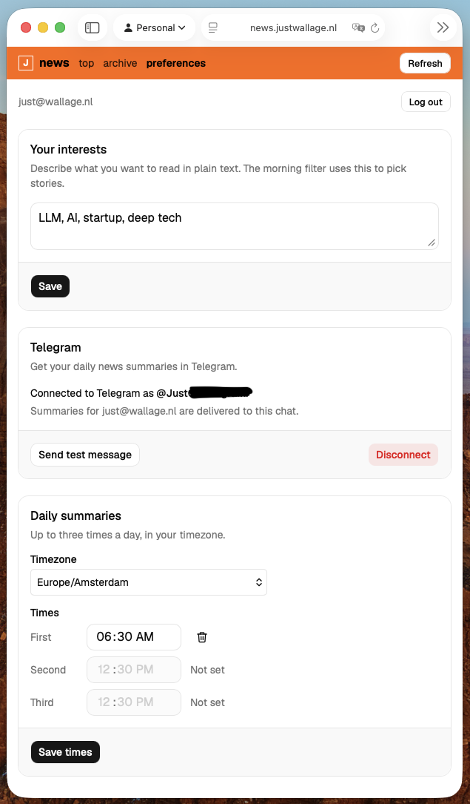
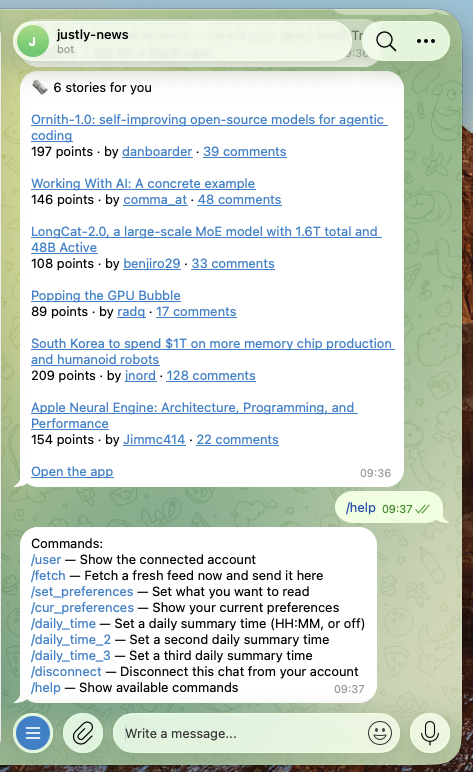

# news

A personal, AI-curated Hacker News front page, live at [news.justwallage.nl](https://news.justwallage.nl). Sign in with Google and get your own feed.

Built AI-first: nearly every feature shipped via a single prompt + [my custom review loop](https://github.com/JustWallage/justly-skilled), gated by pnpm check and a hermetic E2E pipeline.

<table>
  <tr>
    <td width="33%"></td>
    <td width="33%"></td>
    <td width="33%"></td>
  </tr>
</table>

# Why

### Staying up to date is a chore

Staying up to date with the latest releases and discussions in the tech scene is hard for me, especially since most content is not in your interest. Yet I feel it's necessary to digest at least some news to keep up with the current pace of the current software trends. I wanted a minimal webapp that simply filtered Hacker News based on my (current) preferences and sends me notifications every morning.

### ~~Learning~~/Rapid prototyping is fun

I wanted to see how quickly I could get an MVP live (~1 hour of development) and wanted to setup the project to allow quick iterations for new features. I can now rapidly add new features; usually in a single prompt + a review when it's done. My deployment pipeline gives me the confidence that everything still works.

# How

Minimalistic stack built on Cloudflare. Focus on AI driven development with strict guardrails. Confident deployments because of the deployment pipeline.

## Stack

- React SPA + Hono API + Zod
- Cloudflare Workers
- Google OAuth sign-in
- D1 + Drizzle
- Posthog analytics
- Algolia HN API
- Workers AI for filtering (Llama 3.3 70B)
- Terraform
- Github Actions
- Playwright + Vitest
- Telegram bot (via one-click connect link)

## Optimized for LLMs

- Strict guardrails
  - `pnpm check` gate: format, lint, typecheck, knip, jscpd, terraform, unit tests
  - E2E Tests run in <10s on device/container
- Everything can be run locally and in LLMs' cloud containers
- Scattered `CLAUDE.md` throughout codebase which contain context relevant ONLY to that area (added to LLM context automatically)
- Review loops: LLM is instructed to validate its own implementation proposal, then asks user for confirmation. When code is written, a code review loop is initiated. See [justly-skilled](https://github.com/JustWallage/justly-skilled).

## Fully ephemeral E2E stage in pipeline

The pipeline constructs a temporary instance of the full app + an empty D1. Runs the E2E tests againsts it, then discards. So I can safely run multiple E2E stages in parallel without disturbing each other.

## Security

Sessions are opaque random tokens stored SHA-256 hash; sign-in is Google OAuth. Cloudflare Turnstile (anti bot protection). Feed refresh rate-limited per user to bound Workers AI cost. Strict CSP (`public/_headers`) + HSTS, `X-Frame-Options`, nosniff and a referrer policy, and state-changing requests are Origin-checked on top of the SameSite cookie.

# DIY

Feel free to tryout this app yourself:

```sh
pnpm install
cp .dev.vars.example .dev.vars   # local identity + test token
pnpm dev                         # http://localhost:5173
pnpm check                       # format, lint, types, knip, jscpd, terraform, unit + e2e tests
pnpm test:e2e:setup              # once: node deps + Chromium binary (no apt/sudo)
pnpm test:e2e                    # Playwright
```

`pnpm dev` (local) hits the **real** Hacker News + Workers AI (so you can debug the live pipeline); the Workers AI binding proxies to the real service, so run `wrangler login` first. **e2e is hermetic** — deterministic fakes (canned stories + a keyword filter), no network or cost.

## Setup & deploy

One-time cloud setup is in [docs/BOOTSTRAP.md](docs/BOOTSTRAP.md). Pushing to
`main` runs the full pipeline (checks → terraform → ephemeral E2E → deploy).
